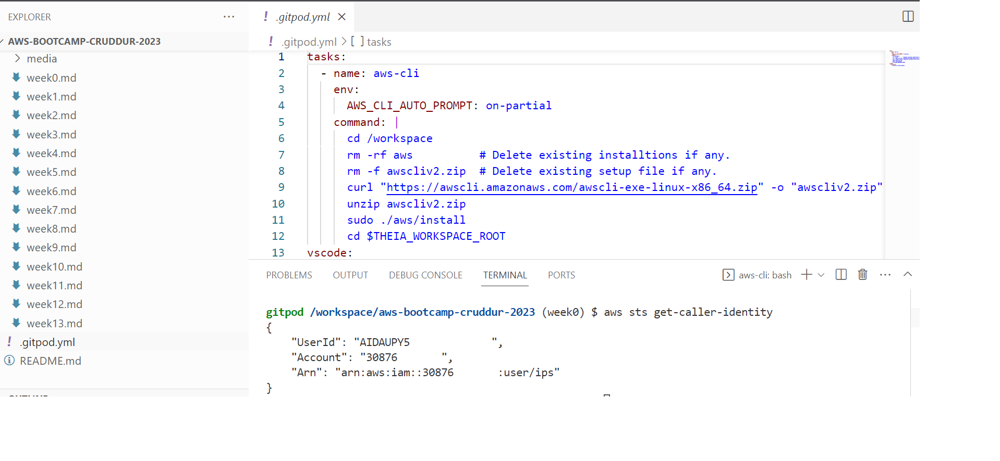

# Week 0 — Billing and Architecture

## Initial set up by Root User

### IAM User Creation
For performing various tasks during the bootcamp an IAM user was created as below-
- Logged in as root user.
- Created a user named `ips` from the IAM console.
- `Enabled console access` for the user.
- User was added to the `Admin` group.
- Created `Access Key` from `Security Credentials` tab for CLI access.
- Download the CSV with the credentials

### Enable Billing 

Enabled biling alerts for the AWS account from Billing page using root user.


### MFA enabled for root and admin user

MFA was set up for the root and admin users using Virtual authenticator app.


## Configuration with Admin User.

### Gitpod Workspace Set Up

Gitpod will be used for development in the Bootcamp, so aws cli was installed in the gitpod workspace using gitpod.yml. Two ways were tried-
- INIT - It installs CLI during new workspace creation but on workspace restart AWS CLI will be lost.
- COMMAND - Executes whenever a workspace is created/restarted, so AWS CLI will always be available.

### Install AWS CLI

Updated `.gitpod.yml` to include the following task.

```sh
tasks:
  - name: aws-cli
    env:
      AWS_CLI_AUTO_PROMPT: on-partial
    command: |
      cd /workspace
      rm -rf aws          # Delete existing installation if any.
      rm -f awscliv2.zip  # Delete existing setup file if any.
      curl "https://awscli.amazonaws.com/awscli-exe-linux-x86_64.zip" -o "awscliv2.zip"
      unzip awscliv2.zip
      sudo ./aws/install
      cd $THEIA_WORKSPACE_ROOT
```

### Store User Credentials for Gitpod Workspace
Gitpod can securely store env. variables per workspace, so user credentials related env vars were set up by executing below commands.

```
gp env AWS_ACCESS_KEY_ID="ABCDEFGHIJKLMNOP"
gp env AWS_SECRET_ACCESS_KEY="ABCD_1234_EFGHIJKL"
gp env AWS_DEFAULT_REGION="us-east-1"
```
### Verify AWS CLI set up and AWS access

Verified that the CLI is installed and the user can connect to AWS account using the credentials stored in gitpod.



## Alarm and Budget Set Up

### Automation of Alarm set up.

As a standard practice every AWS account should have alerts/alarm set up to notify admins whenever the expected spend thresholds are breached. 

- Created a `bash script` to execute various AWS CLI commands in one shot to reduce manual effort.
- Script expects name of the "SNS topic" and "subscriber's email address".
- Script auto updates the relevant json config file before executing next command.

```sh
#!/bin/sh
sns_name=$1
subscriber_email=$2

#Create SNS Topic
echo "###Creating SNS topic###"
sns_arn=$(aws sns create-topic --name $sns_name | jq -r '.TopicArn')
echo "SNS topic for Billing Alarm has arn- ${sns_arn}"

#Create Subscription
if [ -z "$subscriber_email" ]
then
        echo "###No Subscriber email provided###"
else
        echo "###Setting Subscription for the email ID###"
        subscribe_output=$(aws sns subscribe --topic-arn $sns_arn --protocol email --notification-endpoint $subscriber_email)
        echo $subscribe_output
fi

# Create Alarm using "EstimatedCharges" metric.
cat alarm.json | jq '.AlarmActions = [ $sns ]' --arg sns $sns_arn > alarm_config.json
echo "final alarm config saved in 'alarm_config.json' file for refereence."

echo "Creating CW Alarm now"
aws cloudwatch put-metric-alarm --cli-input-json file://alarm_config.json
```
#### Script Execution and Account View


### Monthly Budget set up.
Created a montly budget that will send alerts when `ACTUAL_SPEND` reaches 80% and 100% of the monthyly threshold(5 dollars).

```
aws budgets create-budget \
    --account-id $account_id \
    --budget file://automation/config/json/budget.json \
    --notifications-with-subscribers file://automation/config/json/budget-subscribers.json
```    


# Extended Work for the Week

## Conceptual Design on Napkin

Please refer the conceptual design for the Cruddur application below. This is as per my understanding after reading the bootcamp outline document created by Andrew.


## Logical Design for Currudur

Please refer the logical design for the Cruddur application below. This is as per my understanding after reading the bootcamp outline document created by Andrew.


